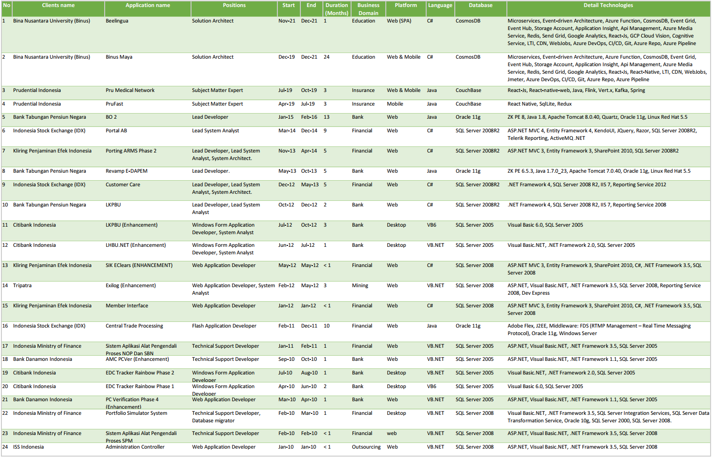

### Summary

### Details

#### [Bank Tabungan Pensiun Negara (BTPN)](https://www.btpn.com/)
##### Bank Operasional 2
###### Jan 2015 - Feb 2016
Bank Operational 2 system is a system that responsible to manage payroll fund that has been allocated by the Indonesian government to BTPN. The system was built using *ZKoss PE 8, Java 1.8, Apache Tomcat 8, Oracle 11g, Linux Redhat 5.5*. In this project, Fajri successfully leads a developer team to plan and develop the system.

#### [Indonesian Stock Exchange (IDX)](https://www.idx.co.id/en-us/)
##### [Portal Anggota Bursa](https://www.idxportal.co.id/)
###### Mar 2014 - Dec 2014
Portal Anggota Bursa is a system responsible to manage communication channels between exchange members within IDX. The system has features to create questionnaires related to services that were being provided by IDX, managing exchange members, notification to exchange members, reporting from exchange member to IDX. The system was built using *ASP.NET MVC 4, Entity Framework 4, KendoUI, JQuery, Razor, SQL Server 2008R2, Telerik Reporting, ActiveMQ*. In this project, Fajri successfully leads a developer team to plan and develop Portal Anggota Bursa. 

#### [Kliring Penjaminan Efek Indonesia (KPEI)](http://www.kpei.co.id/)
##### Porting ARMS Phase 2
###### Nov 2013 - Apr 2014
ARMS is a set of systems that responsible to accommodate: Collateral transactions, stock eligibility, Stock Analysis, and others. In this project, the ARMS need to be migrated from legacy systems to the state-of-the-art system at the time. In this project, Fajri successfully leads a team and develop a subset of the ARMS systems. This project executed using *ASP.NET MVC 3, Entity Framework 3, SharePoint 2010, SQL Server 2008R2*.

#### [Citibank Indonesia](https://www.citibank.co.id/portal/bahasa_home/index.htm)
##### Laporan Kantor Pusat Bank Umum (LKPBU)
###### Oct 2012 - Dec 2012
LKPBU is a report management system that compiles and reports to the Indonesian Central Bank (BI) in monthly or quarterly. The system is web-based that connected to the BI using extranet network. The reporting system has objectives to standardise and to centralise nationwide bank report to the BI. In this project, Fajri leads a small team and develop partial features of the application. The application was built using *.NET Framework 4, SQL Server 2008 R2, IIS 7, Reporting Service 2008*.

#### [Indonesian Ministry of Finance](https://www.kemenkeu.go.id/en)
##### SPM Controlling System
###### Feb 2010 - Mar 2010
Directorate-General Debt Management (DJPU) of Indonesian ministry of finance responsible to ensure payment of debts successfully received by lenders/creditor. In order to achieve that DPJU creates the SPM system. The system was built using *ASP.NET, Visual Basic.NET, .NET Framework 3.5, SQL Server 2008*. In this project, Fajri supported the project as a technical support developer and ensure the running system works in implementation and operational phase.
